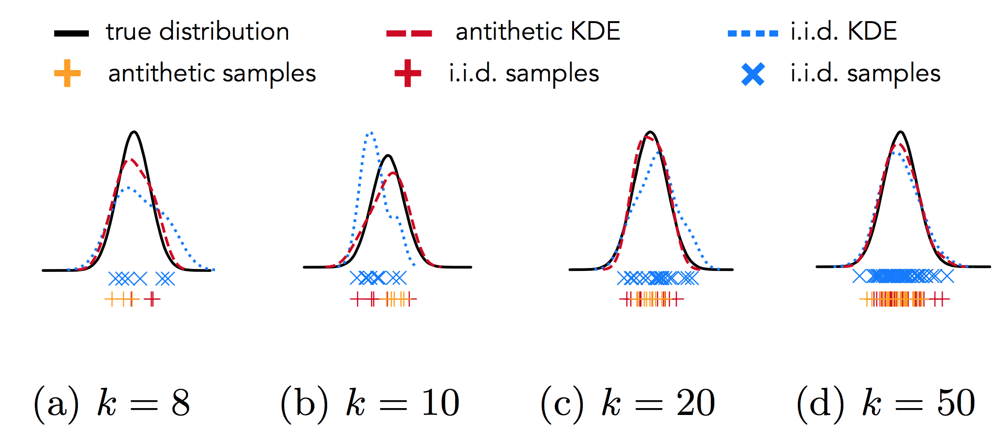
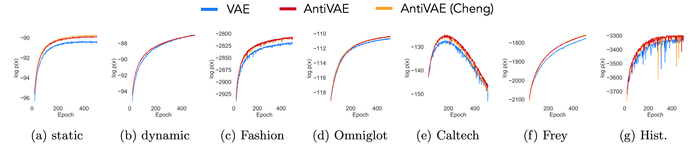
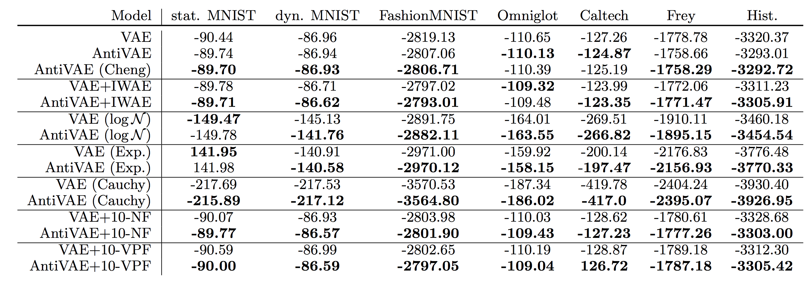

# antithetic-vae-public

PyTorch implementation for [Differentiable Antithetic Sampling for Variance Reduction in Stochastic Variational Inference](https://arxiv.org/abs/1810.02555) by Mike Wu, Noah Goodman, and Stefano Ermon (to appear in AISTATS 2019).

## About

Stochastic optimization techniques are standard in variational inference algorithms. These methods estimate gradients by approximating expectations with independent Monte Carlo samples. This paper explores a technique that uses correlated, but more representative, samples to reduce estimator variance. Specifically, it shows how to generate antithetic samples that match sample moments with the true moments of an underlying importance distribution. Combining a differentiable antithetic sampler with modern stochastic variational inference, the paper shows a series of experiments depicting the effectiveness of this approach for learning a deep generative model.

### Main Intuition

If we use very few samples to approximate an expectation, the sampled distribution may not be very representative of the true distribution. Instead, if we also use antithetic samples, we can hope to cancel out some first-order errors. Traditionally, antithetics only involves flipping samples across some center point. However, Cheng and Marsaglia present two methods to antithetically match opposing first and second moments.

Further, if the antithetic sampling process is differentiable, and we use it in the context of a deep generative model, we may encourage to model to "explore" more, since it can rely on antithetics as a crutch.



### Main Results

The main point is that using differentiable antithetics in learning VAEs improves the density estimator, as measured by (1) log-likelihood on a held-out test set and (2) learning speed. Crucially, without differentiability, we do not see such gains. In practice, Cheng and Marsaglia do not differ much, but we prefer the latter as it is much easier to understand.




## Datasets

We use many classic datasets for density estimation: MNIST, OMNIGLOT, FashionMNIST, Histopathology, Caltech101, and FreyFaces. Many of these are available in torchvision, but for the others, I've included a frozen version that should be downloaded [here](https://figshare.com/articles/antithetic-vae-datasets/7531013).

Place the downloaded `datasets/` directory in the root of this repository.

## Usage

Training is done using the following command:

```
python train.py <dataset> <model> (--backprop) (--iwae) (--n-norm-flows) (--n-volume-flows) (--cuda)
```

After `N` epochs, this will save the test log-likelihood curve to the filesystem (specified by `--out-dir`).

The user can specify the model to use the IWAE loss, or normalizing/volume-preserving flows. `--backprop` only takes effect if the model is `cheng` or `marsaglia`, meaning the default behavior is to not differentiate through antithetics.

### Requirements

We use PyTorch 0.4.1 and any compatible versions of NumPy, SciPy. We also use cPickle and tqdm.

## Citation

If you find this useful for your research, please cite:

```
@article{wu2018differentiable,
  title={Differentiable Antithetic Sampling for Variance Reduction in Stochastic Variational Inference},
  author={Wu, Mike and Goodman, Noah and Ermon, Stefano},
  journal={arXiv preprint arXiv:1810.02555},
  year={2018}
}
```
